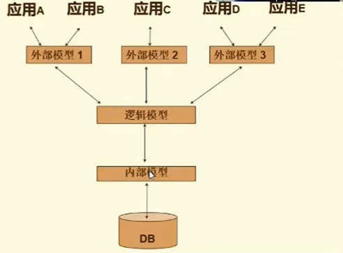
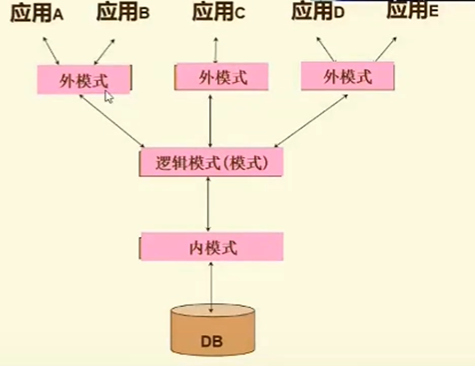
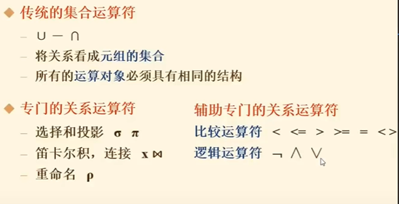

# 数据库基础

## 基本概念
**数据库**
    按一定的数据模型组织

**数据库管理系统**

**数据库系统**
    数据库、数据库管理系统、应用系统、相关使用、管理、开发人员

**数据库的体系结构**

三层模式
  

三级模式，两层映像
  

一个数据库只有一个逻辑模式，但是有多个外模式
内模式也叫物理模式

外模式/模式映像保证了数据的逻辑独立性

**数据模型**
* 模型分类  
    关系模型  
    半结构化模型  
    * 网状模型  
    * 层次模型  
    * XML  
    * JSON  

## 关系模型
**关系数据结构**

**域**

## 完整性约束
**实体完整性**  
主码唯一且不能为空  
主属性不能取空值

**参照完整性规则**  
外码的取值必须为：被参照表中的某个元组的主码值，或者取空值

**用户自定义完整性**  
用户可以自定义一些规则

## 关系代数
执行SQL语句时，会转换成关系代数或相似的内部表现形式

**什么是关系代数**  
一种抽象的数据查询语言
* 运算对象 - 关系
* 运算符 - 4类
* 运算结果 - 关系

**运算符分类**

* 投影  
  从R中抽取目标属性的数据
* 选择
  从R中选择满足要求的数据

