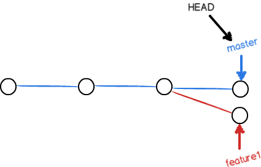

# git 指令

```
git add {file} 添加修改到暂存区
git commit -m "{备注}"  讲暂存区的文件提交，生成新的版本
git status 查看文件的变化
git log     查看版本记录
git reflog  查看历史修改记录
git reset --hard HEAD^      重置会上个版本
git reset --hard {标识号}   重置会目标版本，可只写版本号的前几位，git会自动追踪
git checkout --{file}   恢复到暂存区中的文件，如果暂存区没有文件，则恢复到上个版本。但是不能连续撤回

git rm --{file}     从版本库中删除某个文件（需要再git commit）
```

**远程仓库**

通过`git bash`设置`ssh`  略

`git remote add origin git@github.com:hou2529994315/TestGit.git`        添加远程库，远程库的名字叫做`origin`


* 首次推送
`git push -u origin master`     把当前分支`master`推送到远程

由于远程库是空的，我们第一次推送`master`分支时，加上了-u参数，Git不但会把本地的`master`分支内容推送的远程新的`master`分支，还会把本地的`master`分支和远程的`master`分支关联起来，在以后的推送或者拉取时就可以简化命令。

* 再次推送
`git push origin master`        由于已经关联，不在需要`-u`


**从远程库克隆**
`git clone {自己的地址}`  
GitHub给出的地址不止一个，还可以用https://github.com/michaelliao/gitskills.git这样的地址。实际上，Git支持多种协议，默认的git://使用ssh，但也可以使用https等其他协议。


`git checkout -b dev`       新建分支dev  `-b`参数表示创建并切换分支

`git checkout {分支名}`      切换分支


`git branch`            列出所有分支，当前分支前面会标一个*号

```
git branch

* dev
  master
```

`git merge {分支名}`     把另一个分支的内容合并到当前分支
```
git merge dev

Updating 6409e7d..5a66c95
Fast-forward
 readme.txt | 4 +++-
 1 file changed, 3 insertions(+), 1 deletion(-)
```
Fast-forward`告诉我们，这次合并是“快进模式”,合并完成后，就可以放心地删除dev分支了

`git branch -d {分支名}`        删除分支

由于切换分支使用`git checkout <branch>`,而前面讲过的撤销修改则是`git checkout -- <file>`,两者是同一个命令，有点迷惑，所以最新版的Git提供了新的`git switch`命令来切换分支

`git switch -c dev`         创建并切换到新的dev分支
`git switch master`         直接切换到已有的master分支


## 解决冲突

如果新建了一个分支，并且新的分支和`master`都进行了修改，就会编程下边这样



此时使用合并指令的时候会提示存在冲突


Git用`<<<<<<<`，`=======`，`>>>>>>>`标记出不同分支的内容
如：
```
<<<<<<< HEAD
Creating a new branch is quick & simple.
=======
Creating a new branch is quick AND simple.
>>>>>>> feature1
```

修改冲突部分再次使用`git add `, `git commit`进行提交，即可完成两者的合并

并且可以使用带参数的`git log`查看分支的合并情况
`git log --graph --pretty=oneline --abbrev-commit`

```
*   4322cf0 conflict fixed
|\  
| * 94fa7a9 AND simple
* | a0932ce & simple
|/  
* 5a66c95 branch test
* 6409e7d 测试第二次推送到远程仓库
* 85971d1 测试提交到远程仓库
* 5b01d46 remove test.txt
* 994e55e add test.txt
* 60ceb97 测试checkout
* 9b98464 git tracks changes
* 40beaac understand how stage works
* e37aa43 append GPL
* 409a7d1 add distributed
* 2f68874 write a readme file
```
合并后删除分支文件即可


## 分支管理
如果可以，git会默认使用`Fast forward`模式进行合并，但是这样会丢失分支信息
可以使用`--no-ff`禁用`Fast forward`模式

`git merge --no-ff -m "merge with no-ff" dev`

正常情况下，应该有一个稳定的`master`分支，发布新版本才用；有一个干活的`dev`分支；每个人有一个自己的分支，然后不定时的往`dev`分支合并


`git stash`     保存工作现场
`git stash list`    查看现有的工作现场
`git stash apply`   恢复工作现场，但是需要使用  `git stash drop`来删除
`git stash pop`     恢复工作现场的同时删除它

如果有多个工作现场，也可以指定恢复哪一个
```
git stash apply stash@{0}
```

如果要丢弃一个没有被合并过的分支，可以通过`git branch -D <name>`强行删除。


## 团队合作
队友的最新提交和你试图提交的文件有冲突
先用`git pull`把最新的提交抓取下来，然后在本地合并，解决冲突，再提交上去


**暂时没有遇到，记录一下**
```
git pull
There is no tracking information for the current branch.
Please specify which branch you want to merge with.
See git-pull(1) for details.

    git pull <remote> <branch>

If you wish to set tracking information for this branch you can do so with:

    git branch --set-upstream-to=origin/<branch> dev

git pull也失败了，原因是没有指定本地dev分支与远程origin/dev分支的链接，根据提示，设置dev和origin/dev的链接

git branch --set-upstream-to=origin/dev dev
Branch 'dev' set up to track remote branch 'dev' from 'origin'.

再pull：
git pull
Auto-merging env.txt
CONFLICT (add/add): Merge conflict in env.txt
Automatic merge failed; fix conflicts and then commit the result.

```


## 变基（rebase）

## Tag