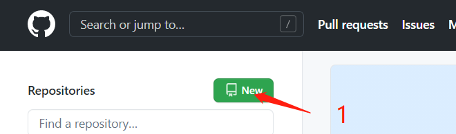
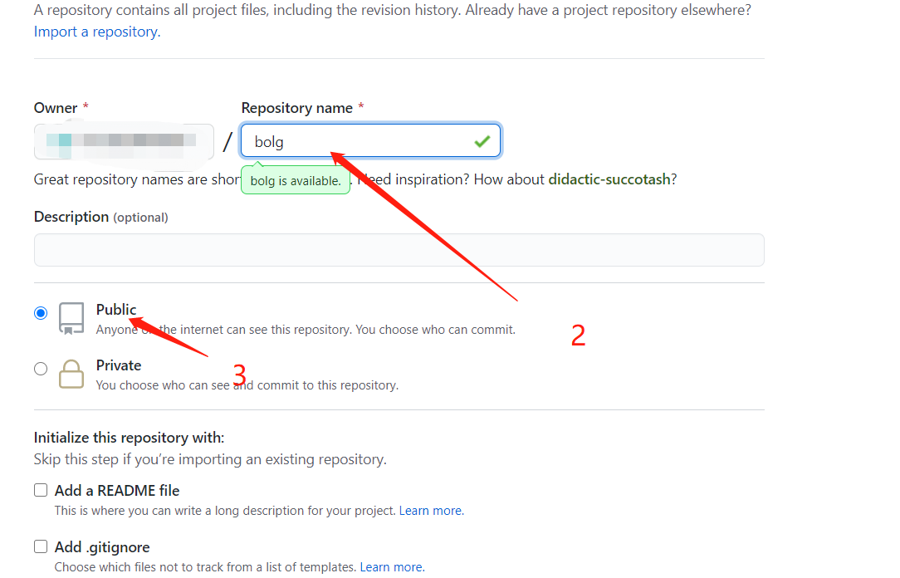
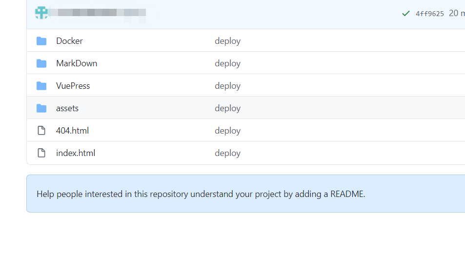
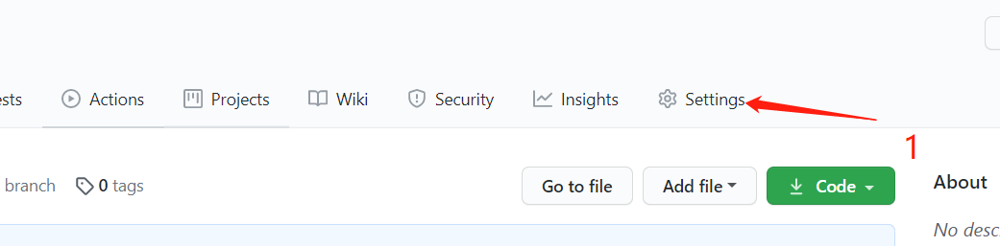
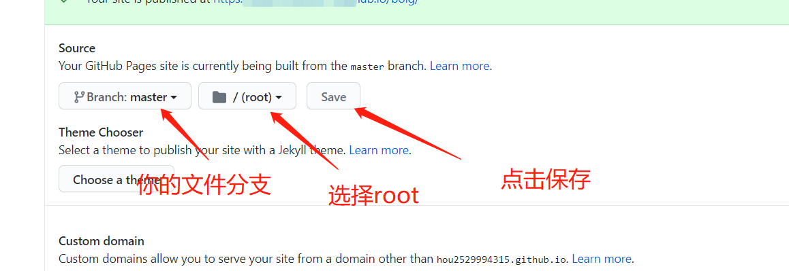
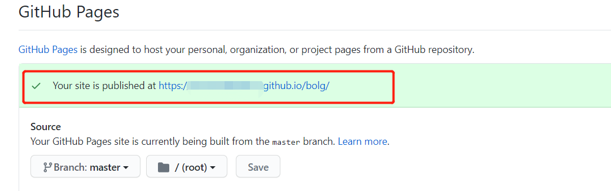

# 网站部署

## 使用cnpm部署到Git Page

### 创建github仓库

  
根据自己的需求填写仓库名称，此示例使用 `blog`
注意一定要选择`public`，私有仓库会限制访问


### 配置本地vuepress工程
添加文件夹 `/docs/.vuepress/`
添加配置文件 `/docs/.vuepress/config.js`
文件内需要有如下内容
```
module.exports = {
    base:'/blog/'  //github上的仓库名字
}
```

### 添加部署文件
在`package.json`的同级目录创建文件 `deploy.sh`

文件内容为
```
#!/usr/bin/env sh

# 确保脚本抛出遇到的错误
set -e

# 生成静态文件
npm run docs:build

# 进入生成的文件夹
cd docs/.vuepress/dist

# 如果是发布到自定义域名
# echo 'www.example.com' > CNAME

git init
git add -A
git commit -m 'deploy'

# 如果发布到 https://<USERNAME>.github.io
git push -f git@github.com:<USERNAME>/bolg.git master
cd -
```

`package.json`文件中添加
```
 "scripts": {
    "deploy": "bash deploy.sh"
  },
```

终端路径调整会工程根目录，输入指令
```
cnpm run deploy
```

如果出现报错，提示没有 `bash` 命令，请看[bash指令的添加]()
如果没有报错，那么此时仓库中应该已经出现了你上传的文件。
  


### 修改github设置
点击 `setting`

  
一直向下翻找到 **Source**选项
  
  

此时应该会提示你网站的发布位置

  
打开该链接，即可访问你的网站了

## bash指令的添加


