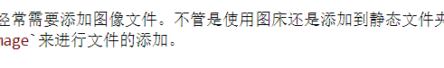
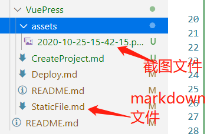

# 静态资源

## 相对路径
vuepress中，所有的markdow文件都会被webpack编译成Vue组件，并且倾向于使用相对路径来引用所有的静态资源。

## 公共文件
如果你需要提供一个静态资源，但是它们并不直接被你的任何一个 markdown 文件或者主题组件引用 —— 举例来说，favicons 和 PWA 的图标，在这种情形下，你可以将它们放在 .vuepress/public 中， 它们最终会被复制到生成的静态文件夹中。

## 基础路径
如果你的网站会被部署到一个非根路径，你将需要在 .vuepress/config.js 中设置 base。

举例来说，如果你打算将你的网站部署到 https://foo.github.io/bar/，那么 base 的值就应该被设置为 "/bar/" (应当总是以斜杠开始，并以斜杠结束)。
[**网站部署**](/VuePress/Deploy/)的时候需要设置base。

## 添加静态文件
创建文件夹`/docs/assets` 用来存储静态文件

## 插件
我们编辑markdown的时候经常需要添加图像文件。不管是使用图床还是添加到静态文件夹中的步骤都过于复杂。因此建议使用插件`Paste Image`来进行文件的添加。

下方是添加图片的代码

```

```

下方是添加的图片
  

  
图片和文件的结构如下图
  
